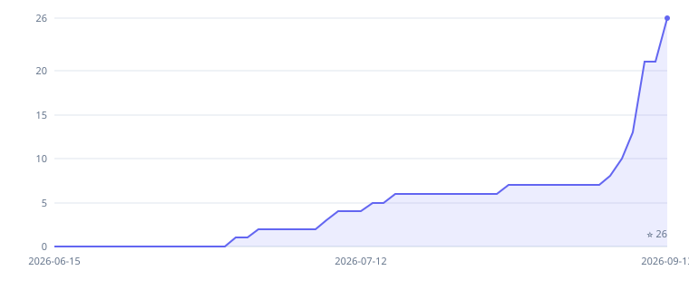

<div align="center">

<picture>
  <source media="(prefers-color-scheme: dark)" srcset="./docs/branding/inkvoice-lockup-dark.png">
  
</picture>

### Open-source invoicing for freelancers & small teams

Create invoices, get paid online, track expenses, and **own your data** — all from a single ~50&nbsp;MB container.
A self-hostable alternative to FreshBooks, Wave, Zoho Invoice & Invoice Ninja.

[](https://github.com/pigontech/inkvoice/actions/workflows/ci.yml)
[](./LICENSE)

[](./CONTRIBUTING.md)
[](https://github.com/pigontech/inkvoice/stargazers)

**[Live Demo](https://demo.inkvoice.app) · [Inkvoice Cloud](https://cloud.inkvoice.app) · [Documentation](https://docs.inkvoice.app) · [Website](https://inkvoice.app)**

<sub>⭐ **Star history** — auto-updated weekly in [`metrics/stars.svg`](./metrics/stars.svg).</sub>




</div>

## Why Inkvoice

Inkvoice is a lightweight, **self-hosted** invoicing dashboard for people who'd rather own their billing than rent it. Send professional invoices, get paid online, keep an eye on expenses, and hand clean numbers to your accountant — without per-seat pricing or data lock-in.

- 🗄️ **Own your data** — everything lives in a single SQLite file you control.
- 📦 **One container, runs anywhere** — Docker, [Coolify](https://coolify.io), or [one-click on Dokploy](https://dokploy.com/templates/inkvoice); ~50–100&nbsp;MB RAM.
- ⚡ **Modern & fast** — Bun + Hono + React, no heavyweight runtime.
- 🌍 **Multi-currency, multi-user, multi-language** out of the box.
- ☁️ **Don't want to self-host?** Use the managed **[Inkvoice Cloud](https://cloud.inkvoice.app)** and skip the ops.

<div align="center">


<sub>📊 **Real production usage** on a [Dokploy](https://dokploy.com) host — Inkvoice idles at **~1% CPU** and **41.79 MiB RAM** (of a 512 MiB cap). The whole app comfortably fits on the cheapest VPS tier.</sub>

</div>

> Try it right now on the **[live demo](https://demo.inkvoice.app)** — no signup required, sign in with `demo` / `demo`.

## Features

**Invoicing**
- Full lifecycle: draft → send → paid → void, plus one-click duplicate
- Line items, discounts and multiple tax rates with auto-calculation
- Polished PDF export straight from the browser's print dialog, with customizable Mustache templates
- Public shareable links with **read receipts** — see when a client opens an invoice

**Quotes & recurring**
- Quotes you can share and convert into invoices
- Recurring invoices with automated generation on a schedule

**Get paid**
- Online card payments via **Stripe** & **PayPal**
- Manual and partial payment tracking

**German e-invoicing (E-Rechnung)**
- Opt-in module, **off by default** — only German users need it, everyone else never sees it
- Emit **EN 16931**-compliant e-invoices: **ZUGFeRD 2.2 hybrid PDF**, **XRechnung (UBL)** and **PEPPOL BIS**
- **E-invoice inbox** — import, parse and process incoming XRechnung / ZUGFeRD files
- Auto-attach the e-invoice to sent invoice emails (per-invoice or globally)

**PEPPOL transport**
- Send invoices and credit notes over the **PEPPOL network** (provider-agnostic; peppol.sh driver ships with bring-your-own credentials)
- **Receive** inbound PEPPOL documents straight into the e-invoice inbox
- Delivery state machine with retries and per-attempt audit trail
- Register your business as a PEPPOL receiver, with conflict detection (no accidental access-point takeover)

**Money & books**
- **Multi-currency** with live exchange rates + base-currency consolidated reporting
- **Expense tracking** — billable expenses, receipts and categories
- Customer **account statements** (PDF per period)
- **Reports** — tax summary, A/R aging, revenue by customer & product, profit & loss, expenses by category, currency breakdown, and cash-flow forecast — every report exports to **CSV**

**Platform**
- Multi-user with **role-based permissions** and an activity log
- Built-in **i18n** (English, Turkish, Spanish, German & French — easy to add more)
- **Dark mode**, fully responsive
- Single Docker container, native SQLite, tiny footprint

## Screenshots

|  |  |
| :---: | :---: |
| **Invoices** | **Invoice detail** |
|  |  |
| **Reports (Profit & Loss)** | **Customers** |
|  |  |
| **Products & services** | **Dark mode** |
|  |  |

## Quick Start

### Docker (recommended)

Inkvoice ships as a **prebuilt multi-arch image** (`linux/amd64` + `linux/arm64`), so there's nothing to clone and nothing to build:

```bash
docker run -d --name inkvoice \
  -p 3000:3000 \
  -v invoice-data:/app/data \
  --memory 512m \
  -e JWT_SECRET="$(openssl rand -base64 48)" \
  -e ADMIN_PASS="change-me-please" \
  ghcr.io/pigontech/inkvoice:latest
```

Open **[http://localhost:3000](http://localhost:3000)** and log in with `admin` and the password you set.

Prefer Compose? Save this as `docker-compose.yml` and run `docker compose up -d`:

```yaml
services:
  app:
    image: ghcr.io/pigontech/inkvoice:latest
    ports:
      - "3000:3000"
    volumes:
      - invoice-data:/app/data
    mem_limit: 512m
    environment:
      JWT_SECRET: change-this-to-a-random-string-of-at-least-32-chars
      ADMIN_PASS: change-me-please
    restart: unless-stopped

volumes:
  invoice-data:
```

> **Keep the 512 MB cap.** Bun sizes its heap to the memory it can see, so the cap is what keeps
> Inkvoice in its usual ~60 MB working set. Measured on a fresh install: **62 MB** capped at 512 MB,
> versus **118 MB** uncapped.
>
> **Image tags:** `latest` tracks `main`. For a stable deployment, pin a release tag such as
> `ghcr.io/pigontech/inkvoice:0.3.0`.
>
> **Going public?** Put it behind HTTPS and add `-e COOKIE_SECURE=true -e ENABLE_HSTS=true`.
> Staying on plain HTTP? Add `-e COOKIE_SECURE=false`. It defaults to true, which marks the
> session cookie Secure, and browsers drop that on every non-HTTPS address except localhost,
> so logins fail with no visible error.

### Manual (development)

```bash
bun install
bun run dev          # backend (:3000) + frontend (:5173) together
```

### Build for production

```bash
bun run build        # build the frontend
bun run start        # serve API + static frontend on :3000
```

## Self-Hosting

[](https://dokploy.com/templates/inkvoice)
[](#coolify)
[](#plain-docker)

Inkvoice ships as a single container — expose port `3000` and mount a volume on `/app/data` so the SQLite database survives redeploys. The fastest path is the [official Dokploy template](https://dokploy.com/templates/inkvoice).

### Dokploy

Inkvoice is in the [official Dokploy templates catalog](https://dokploy.com/templates/inkvoice):

1. In your Dokploy panel, open a project and click **Create Service → Template**.
2. Search for **Inkvoice** and click **Create**.
3. Dokploy generates `ADMIN_PASS` and `JWT_SECRET`, mounts `/app/data`, and routes a domain to port `3000`.
4. Deploy, then sign in as `admin` with the generated password (under the service's environment variables).

The catalog template ships `COOKIE_SECURE=false` so login works on Dokploy's auto-generated HTTP domain. After you attach an HTTPS custom domain, set `COOKIE_SECURE=true` and `ENABLE_HSTS=true`.

To deploy a fork or a custom image tag, create a Compose/Docker service from this repo instead: expose port `3000`, mount `/app/data`, and set `JWT_SECRET` + `ADMIN_PASS`.

### Coolify

1. **New resource → Public Repository** → paste this repo's URL.
2. **Build pack:** Dockerfile (the repo root `Dockerfile`).
3. **Port:** `3000`.
4. **Persistent storage:** add a volume on `/app/data` — without it, every deploy wipes the database.
5. **Environment:** set at least `JWT_SECRET` (≥ 32 chars), `ADMIN_PASS`, and `COOKIE_SECURE=true`.
6. **Domain:** attach one and Coolify issues a Let's Encrypt cert; then set `ENABLE_HSTS=true`.
7. **Health check:** point it at `/health`.

### Plain Docker

```bash
docker build -t inkvoice .
docker run -d \
  --name inkvoice \
  -p 3000:3000 \
  -v invoice-data:/app/data \
  -e JWT_SECRET="$(openssl rand -base64 48)" \
  -e ADMIN_PASS="change-me-please" \
  -e COOKIE_SECURE=true \
  -e ENABLE_HSTS=true \
  inkvoice
```

## Configuration

Copy `.env.example` to `.env` to bootstrap a local config. Most runtime knobs (currency, locale, invoice number pattern, email templates, etc.) live on the in-app **Settings** page — environment variables are reserved for deploy-time concerns (auth, ports, secrets).

### Environment Variables

| Variable                  | Required | Default               | Description                                                          |
| ------------------------- | -------- | --------------------- | -------------------------------------------------------------------- |
| `ADMIN_USER`              | yes      | `admin`               | Initial admin username (created on first boot if no users exist). `demo` when `DEMO_MODE=true` |
| `ADMIN_PASS`              | yes      | `changeme`            | Initial admin password. `demo` when `DEMO_MODE=true`                 |
| `JWT_SECRET`              | yes      | (dev-only fallback)   | JWT signing secret — must be ≥ 32 chars in production                |
| `DATABASE_PATH`           | no       | `./data/invoice.db`   | SQLite database file path                                            |
| `PORT`                    | no       | `3000`                | HTTP listen port                                                     |
| `HOST`                    | no       | `0.0.0.0`             | Bind address                                                         |
| `SESSION_TTL`             | no       | `3600`                | JWT lifetime in seconds                                              |
| `COOKIE_SECURE`           | no       | `true`                | Set to `false` for plain-HTTP development                            |
| `ENABLE_HSTS`             | no       | `false`               | Send HSTS header (set to `true` behind HTTPS)                        |
| `RATE_LIMIT_ENABLED`      | no       | `true`                | Enable login rate limiting                                           |
| `RATE_LIMIT_MAX_ATTEMPTS` | no       | `5`                   | Max failed logins per window                                         |
| `RATE_LIMIT_WINDOW`       | no       | `900`                 | Rate-limit window in seconds                                         |
| `ALLOWED_ORIGINS`         | no       | `localhost:5173,3000` | Comma-separated CORS allow-list                                      |
| `SMTP_HOST`               | no       | —                     | SMTP host. Set this group to enable invoice email sending            |
| `SMTP_PORT`               | no       | `587`                 | SMTP port                                                            |
| `SMTP_USER`               | no       | —                     | SMTP username                                                        |
| `SMTP_PASS`               | no       | —                     | SMTP password                                                        |
| `SMTP_FROM`               | no       | —                     | Sender address                                                       |
| `SMTP_SECURE`             | no       | `false`               | Use TLS (set `true` for port 465)                                    |
| `STRIPE_SECRET_KEY`       | no       | —                     | Stripe secret key (`sk_…`) — enables Stripe online payments          |
| `STRIPE_PUBLISHABLE_KEY`  | no       | —                     | Stripe publishable key (`pk_…`)                                      |
| `STRIPE_WEBHOOK_SECRET`   | no       | —                     | Stripe webhook signing secret (`whsec_…`) — required for Stripe       |
| `PAYPAL_CLIENT_ID`        | no       | —                     | PayPal REST app client ID — enables PayPal online payments           |
| `PAYPAL_SECRET`           | no       | —                     | PayPal REST app secret                                               |
| `PAYPAL_WEBHOOK_ID`       | no       | —                     | PayPal webhook ID — required for PayPal (signature verification)     |
| `PAYPAL_ENV`              | no       | `sandbox`             | PayPal environment: `sandbox` or `live`                              |
| `OIDC_ISSUER_URL`          | no       | —                     | OIDC issuer URL. Setting it enables SSO (must be https; requires `OIDC_CLIENT_ID`/`OIDC_CLIENT_SECRET`) |
| `OIDC_CLIENT_ID`           | no       | —                     | OIDC confidential client id                                             |
| `OIDC_CLIENT_SECRET`       | no       | —                     | OIDC confidential client secret                                         |
| `OIDC_SCOPE`               | no       | `openid email profile`| Space-separated OIDC scopes (`openid` is always included)               |
| `OIDC_ALLOWED_DOMAINS`     | no       | —                     | Comma-separated email domains allowed to self-register (JIT provisioning gate) |
| `OIDC_AUTO_PROVISION`      | no       | `true`                | Auto-create a read-only Viewer account on first SSO login               |
| `OIDC_PROVIDER_NAME`       | no       | —                     | Custom label for the login-page SSO button                              |
| `PEPPOL_SH_API_KEY`       | no       | —                     | peppol.sh API key — enables the PEPPOL transport driver             |
| `PEPPOL_SH_WEBHOOK_SECRET`| no       | —                     | HMAC secret verifying inbound PEPPOL callbacks (required to receive)|
| `PEPPOL_SH_BASE_URL`      | no       | `https://api.peppol.sh`| Provider base URL override (sandbox/proxy). Must be https            |
| `DEMO_MODE`               | no       | `false`               | Periodically reset DB to seeded demo data (for public demo deploys). Also defaults the admin login to `demo`/`demo` and shows it on the sign-in page |
| `DEMO_RESET_INTERVAL`     | no       | `86400000`            | Demo reset interval in ms (default 24h)                              |

### SSO / OIDC

Any standards-compliant OIDC provider (Keycloak, Authentik, Authelia, Entra ID, Okta, Google Workspace, …) can act as the single sign-on source. Set `OIDC_ISSUER_URL`, `OIDC_CLIENT_ID` and `OIDC_CLIENT_SECRET` to enable it — everything else is auto-discovered via `/.well-known/openid-configuration`.

1. Register a **confidential** client at your provider with redirect URI `https://your-domain/api/v1/auth/oidc/callback` (use the origin your install is served from, or set `PUBLIC_BASE_URL`).
2. First-time logins auto-provision a read-only **Viewer** account unless `OIDC_AUTO_PROVISION=false` — promote users in **Users**. Restrict who can self-register with `OIDC_ALLOWED_DOMAINS`.
3. Existing accounts link automatically on first SSO login only when the provider attests the email (`email_verified` claim). Password login remains available and is the admin recovery path.

## Tech Stack

| Layer | Choice |
| --- | --- |
| Runtime | **Bun** |
| Backend | **Hono** + **SQLite** (`bun:sqlite`), **Zod** validation, JWT auth |
| Frontend | **React 19** + **Vite**, **Tailwind CSS** + shadcn/ui |
| PDF | **Mustache** HTML templates, printed by the browser |
| Packaging | Single **Docker** container serving API + static SPA |

## Documentation

- [Architecture overview](./docs/ARCHITECTURE.md) — components, data flow, where to add features.
- [Template variables](./docs/TEMPLATE_VARIABLES.md) — every `{{token}}` available in invoice/quote/email templates.
- [E-Invoicing (E-Rechnung)](./docs/features/e-invoicing.md) — German ZUGFeRD/XRechnung/PEPPOL emission and inbox, step by step.
- [Contributing](./CONTRIBUTING.md) — setup, conventions, and PR checklist.
- Full docs: **[docs.inkvoice.app](https://docs.inkvoice.app)**

## Contributing

PRs are welcome! Please read [CONTRIBUTING.md](./CONTRIBUTING.md) for setup and conventions. Found a bug or have an idea? [Open an issue](https://github.com/pigontech/inkvoice/issues).

## License & trademark

The **source code** is [MIT](./LICENSE) licensed.

The **Inkvoice name and logos are trademarks** and are *not* covered by the MIT
license — see [TRADEMARK.md](./TRADEMARK.md) for what's free to do and what
needs a quick word. Running, forking, and "Inkvoice hosting" are all fine;
hosting providers wanting an **official listing** are welcome to get in touch.
